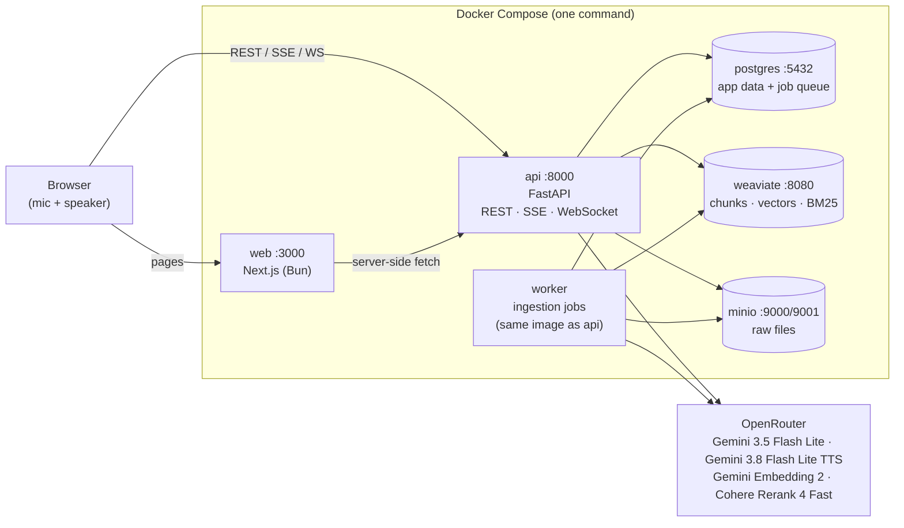
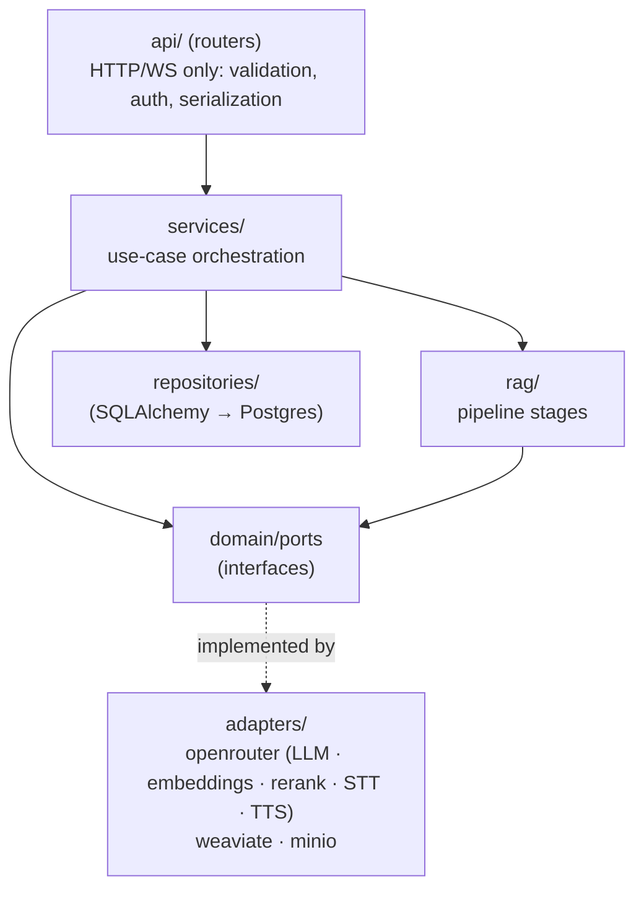
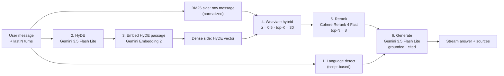
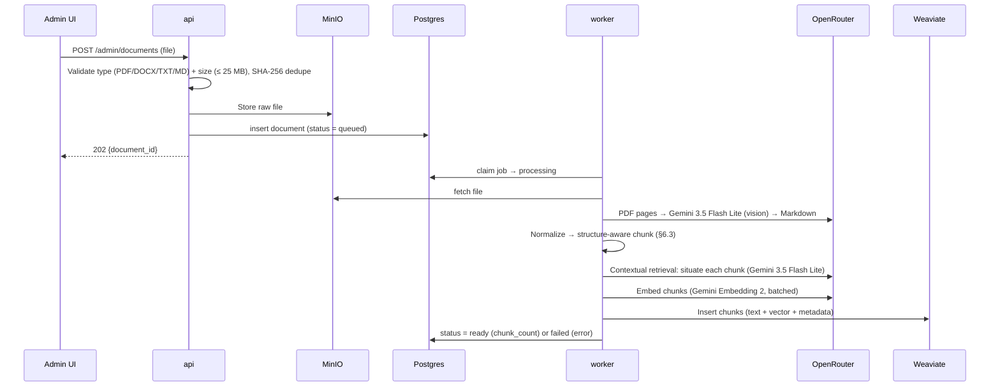
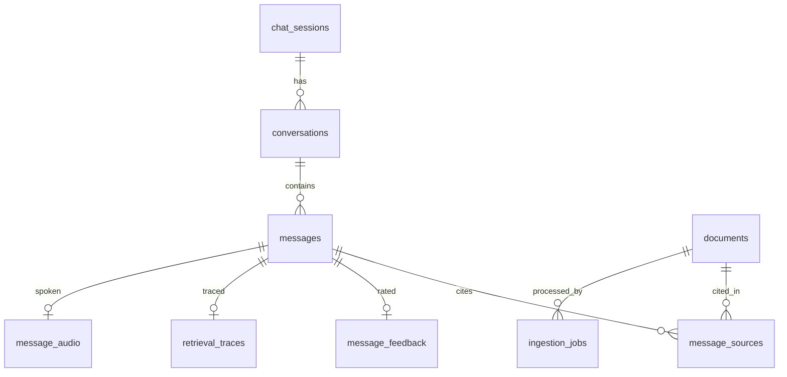

# Inkomoko Assistant: Design & Architecture

> **Status:** DRAFT v0.5 (implemented). All major decisions agreed (§12). AI-assisted; this needs human review before it is shared with Inkomoko.
> **Last updated:** 2026-10-09
> **Repo:** `incomoco` (monorepo)
> **Context:** Demo application

---

## 0. Bottom Line

We are building a **bilingual (Amharic and English) AI assistant for Inkomoko** as a **monorepo**. One `docker compose up` runs the whole stack. It has three parts:

1. **Chat app (Next.js):** a ChatGPT-style chat for anonymous users. It has three input modes:
   - **Text:** type and send.
   - **Transcribe:** dictate with the mic.
   - **Live talk:** a real-time voice conversation, with both sides written out as text.

   Answers can also be **read aloud**.
2. **Admin dashboard (Next.js):** analytics, plus knowledge-base document management (upload, list, delete). Protected by a single demo admin account.
3. **Backend (FastAPI):** a RAG pipeline that runs **HyDE → Gemini embedding → Weaviate hybrid search (α = 0.5) → rerank → grounded generation**. Documents are converted to Markdown, then chunked by their structure with contextual retrieval.

**All AI calls go through OpenRouter, using one API key:**

| Role | Model |
|---|---|
| HyDE, answers, PDF vision → Markdown, speech-to-text, contextual retrieval | `google/gemini-3.5-flash-lite` |
| Text-to-speech | `google/gemini-3.8-flash-lite-tts` |
| Embeddings | `google/gemini-embedding-2` |
| Reranker | `cohere/rerank-4-fast` |

The UI follows **Inkomoko's brand exactly**: Montserrat, coral `#EA4E35`, navy `#00205F`. The code is **layered (ports and adapters)**, so any model or service can be swapped through configuration.

---

## 1. Scope

### 1.1 Goals (v1)
| # | Goal |
|---|------|
| G1 | Answer questions in Amharic or English, grounded in Inkomoko's knowledge base, with citations |
| G2 | Text chat, dictation, live voice conversation (with text transcripts of both sides), and read-aloud |
| G3 | Admins upload and delete documents and see their ingestion status |
| G4 | Admins see usage, quality, and knowledge-gap analytics |
| G5 | A decoupled, maintainable codebase with one-command local setup |

### 1.2 Non-goals (v1)
- No end-user accounts or login.
- No query rewriting and no translation between languages. Chat history goes into the prompts instead (§6.1).
- No external actions (bookings, payments, CRM). The assistant only answers questions.
- No languages other than Amharic and English.
- No document editing.
- No production-grade identity or SSO. This is a demo (§9.1).

---

## 2. Users & Personas

| Persona | Access | Key needs |
|---|---|---|
| **End user** | Chat app, **anonymous**. Identified by a random `session_id` in an httpOnly cookie | Fast, accurate answers in their language; voice for mobile and low-literacy contexts |
| **Admin** | Dashboard, single demo account | Manage the knowledge base; see what users ask and where the bot fails |

Each browser gets its own session. Its conversations appear in the sidebar, and clearing cookies starts a new session.

---

## 3. High-Level Architecture



### 3.1 Transport choices
| Channel | Protocol | Why |
|---|---|---|
| Text chat answers | **SSE** | Simple one-way token streaming |
| Live talk | **WebSocket** | User audio up; transcripts, answer text, and speech audio down; interrupt signals |
| Dictation | REST (one audio clip) | Simple |
| Read aloud | REST, returning audio | Simple |
| Admin | REST (JSON); multipart for uploads | Standard CRUD |

---

## 4. Frontend (Next.js + Bun)

### 4.1 Pages: only what is necessary
| Route | Purpose | Contents |
|---|---|---|
| `/` | Chat | Collapsible conversation sidebar, thread, input box with **mic (dictate)** and **live talk** buttons, EN/አማ toggle |
| `/admin/login` | Admin sign-in | Username + password |
| `/admin` | Overview | KPI cards and three to four key charts |
| `/admin/documents` | Knowledge base | Drag-and-drop upload, document table (name, type, size, status, uploaded at), delete |

### 4.2 Chat UX
- **Text:** answers stream token by token, with Markdown rendering and **source chips** (citations). Each answer has 👍/👎, copy, regenerate, and **🔊 read aloud**.
- **Transcribe (dictation):** tap the mic, speak, tap again. The transcribed text lands in the input box for editing and is not sent automatically.
- **Live talk:** an overlay with an animated orb.
  - Each user turn appears as text right after the user stops speaking.
  - The agent's answer streams as text while it is spoken.
  - The user can interrupt (**barge-in**).
  - Everything stays in the thread as normal messages.
- **Language:** the UI defaults to **English**, and the EN/አማ toggle is remembered per browser. Answers match the language of the user's message.
- **States:** every async element has empty, loading, error, and offline states.
- **Accessibility:** WCAG 2.1 AA contrast, keyboard navigation, ARIA live regions for streaming text, and visible focus rings.
- **Logo:** a text wordmark for now, replaced with Inkomoko's official logo and favicon when they provide them.

### 4.3 Brand & Design Tokens (from inkomoko.com)
These values were extracted from inkomoko.com on 2026-10-09. **Inkomoko should confirm them against their brand guidelines.**

| Token | Value | Use |
|---|---|---|
| `--primary` | `#EA4E35` (coral) | Primary CTAs, mic and live-talk buttons, active states |
| `--primary-foreground` | `#F9FAFB` | Text on primary |
| `--secondary` | `#00205F` (navy) | Body text, headings, user message bubble |
| `--secondary-foreground` | `#F9FAFB` | Text on navy |
| `--info` | `#66CCFF` | Highlights, live-talk orb |
| `--violet` | `#1C56C8` | Secondary accent, links |
| `--background` / `--card` | `#FFFFFF` | Surfaces |
| `--foreground` | `#030712` | Highest-contrast text |
| `--muted` / `--accent` | `#F3F4F6` | Assistant bubble, hover states |
| `--muted-foreground` | `#6A7282` | Timestamps, helper text |
| `--border` / `--input` | `#E5E7EB` | Borders, inputs |
| `--destructive` | `#E40014` | Delete, errors |
| `--radius` | `0.625rem` | Cards and inputs; **buttons are pill-shaped** (`rounded-full`) |
| Chart palette | `#F05100`, `#009588`, `#104E64`, `#FCBB00`, `#F99C00` | Admin charts |

**Typography:**
- **Montserrat** (variable, 100–900): body 400 at 16px/24px; headings 700; buttons and nav 600–700 at 14px.
- **Amharic:** Montserrat has no Ethiopic glyphs, so the font stack is `Montserrat, "Noto Sans Ethiopic", sans-serif`, loaded through `next/font`.

**Principles:**
- Generous whitespace, one primary action per view, no decorative clutter.
- Built on shadcn/ui and Tailwind, the same primitives inkomoko.com uses.
- Mobile-first.

### 4.4 Frontend code organization (feature-sliced)
```
apps/web/
├── app/                      # Routes only: thin, compose features
│   ├── (chat)/page.tsx
│   └── admin/
│       ├── login/page.tsx
│       ├── page.tsx
│       └── documents/page.tsx
├── features/
│   ├── chat/                 # thread, input box, message, citations, feedback, read-aloud
│   ├── voice/                # dictation + live talk (VAD, WS client, audio player)
│   ├── documents/            # upload, table, delete
│   ├── analytics/            # KPI cards, charts
│   └── auth/                 # admin login, route guard
├── components/ui/            # shadcn primitives: no business logic
├── lib/
│   ├── api/                  # Typed client generated from FastAPI OpenAPI
│   ├── i18n/                 # next-intl
│   └── audio/                # recording, PCM/WAV encoding, playback queue
├── messages/{en,am}.json
├── styles/tokens.css
├── Dockerfile
└── package.json              # bun
```
**Rules:**
- `app/` imports from `features/`.
- Features never import from each other.
- Anything shared lives in `lib/` or `components/`.
- All API calls go through the generated typed client.

---

## 5. Backend (FastAPI + uv)

### 5.1 Layering (ports & adapters)

**Rules:**
- Routers contain no business logic.
- Services depend only on ports.
- Model IDs live in configuration, never in code.
- Swapping a model or vendor means a config change or a new adapter.

### 5.2 Backend code organization
```
apps/api/
├── app/
│   ├── main.py
│   ├── core/                       # settings, logging, security, DI
│   ├── api/v1/
│   │   ├── chat.py                 # POST /chat (SSE), conversations, feedback
│   │   ├── voice.py                # POST /voice/transcribe, POST /voice/speak, WS /voice/live
│   │   ├── admin_auth.py
│   │   ├── documents.py
│   │   └── analytics.py
│   ├── schemas/                    # Pydantic DTOs
│   ├── domain/
│   │   ├── models.py
│   │   └── ports.py                # LLMPort, EmbedderPort, RerankerPort, STTPort, TTSPort,
│   │                               # VectorStorePort, BlobStorePort, DocumentConverterPort
│   ├── services/                   # chat, voice, ingestion, analytics
│   ├── rag/
│   │   ├── pipeline.py
│   │   ├── hyde.py
│   │   ├── retrieval.py
│   │   ├── rerank.py
│   │   ├── generation/             # prompts (en/am), citations
│   │   └── ingestion/
│   │       ├── converters/         # pdf_vision.py, docx.py, text.py → Markdown
│   │       ├── normalizer.py       # Amharic normalization
│   │       ├── chunker.py          # structure-aware chunking (§6.3)
│   │       ├── contextualizer.py   # contextual retrieval (§6.3)
│   │       └── indexer.py
│   ├── adapters/
│   │   ├── openrouter/             # chat, embeddings, rerank, stt, tts clients
│   │   ├── weaviate/
│   │   └── minio/
│   ├── repositories/
│   └── workers/ingest_worker.py
├── migrations/                     # Alembic
├── tests/
├── Dockerfile
└── pyproject.toml                  # uv
```

### 5.3 API surface (v1)
| Method | Path | Auth | Notes |
|---|---|---|---|
| `POST` | `/api/v1/chat` | session | SSE stream with events `delta`, `sources`, `done`, `error` |
| `GET` / `DELETE` | `/api/v1/conversations[/{id}]` | session | Only this session's conversations |
| `POST` | `/api/v1/messages/{id}/feedback` | session | 👍/👎 plus an optional comment |
| `POST` | `/api/v1/voice/transcribe` | session | Audio clip in, `{text, lang}` out |
| `POST` | `/api/v1/voice/speak` | session | `{message_id}` or `{text}` in, audio out (read aloud) |
| `WS` | `/api/v1/voice/live` | session | Live talk (§6.4) |
| `POST` | `/api/v1/admin/login` | none | Sets the admin JWT cookie |
| `POST` / `GET` / `DELETE` | `/api/v1/admin/documents[/{id}]` | admin | Upload returns `202`; deletion follows §7.3 |
| `GET` | `/api/v1/admin/analytics/*` | admin | Aggregates only |

---

## 6. Core Flows

### 6.1 RAG query pipeline


| Stage | Details |
|---|---|
| **1. Language detection** | Based on the Ethiopic Unicode range (U+1200–U+137F), with no API call. Sets the answer language, the TTS voice, and the analytics split |
| **2. HyDE** | Gemini writes a short hypothetical answer passage (~100–150 tokens). The **last N turns (default 6)** are included, so follow-up questions still work without a rewrite step |
| **3. Embedding** | The HyDE passage is embedded with `gemini-embedding-2`, the same model used for chunks |
| **4. Hybrid search** | One Weaviate hybrid query: `query` = the raw message (BM25 side), `vector` = the HyDE embedding (dense side), **α = 0.5**, relative score fusion, **top-K = 30**, limited to `ready` documents |
| **5. Rerank** | `cohere/rerank-4-fast` scores each (user message, chunk) pair and keeps the **top 8**. Chunks below a score threshold are dropped |
| **6. Generation** | Answers **only** from the 8 chunks plus chat history, in the detected language, with citations `[1]…[8]`. If the context is insufficient, it says so. Streaming, temperature ≈ 0.2 |

- **Cross-language questions:** there is no translation step. An Amharic question can match English content through the multilingual embedding space. BM25 adds little in that case, and the dense side carries the retrieval.
- **Prompt-injection guard:** retrieved chunks are wrapped as data, and the system prompt tells the model to ignore any instructions inside them.
- **Tracing:** each turn stores the HyDE text, candidate and rerank scores, final chunk IDs, and per-stage latency in `retrieval_traces`.

### 6.2 Ingestion pipeline (upload → searchable)

The job queue is in Postgres (`SELECT … FOR UPDATE SKIP LOCKED`), so there is no Redis.



**Conversion to Markdown:**

| Type | How |
|---|---|
| **PDF** | Sent to **Gemini 3.5 Flash Lite (vision)** in **page batches of 10–15 pages**, with **no OCR engine**. The prompt asks for a *verbatim* transcription with correct heading levels (`#`, `##`, `###`), tables as Markdown tables, and images as a one-line description. Temperature 0. Page markers are kept for citations |
| **DOCX** | Converted directly in code (Word heading styles become `#` levels), with no LLM |
| **TXT / MD** | Used as-is |

**Normalization:**
- Unicode NFC.
- **Amharic:** unify homophone characters (e.g., ሀ/ሐ/ኀ, ሰ/ሠ, አ/ዐ, ጸ/ፀ) and convert Ethiopic punctuation (`፡`, `።`).
- This normalization applies to BM25 text only. The original text is kept for display.

### 6.3 Chunking: structure-aware, with contextual retrieval

**Chunk boundaries come from the document's structure, not from token counts.** Token counts serve only as size limits: **min 450, max 1,200 tokens**. There is **no overlap**: each chunk is a complete section, and breadcrumbs provide the context.

**Algorithm**
1. **Parse the Markdown into a section tree** (H1 → H6). The content under each heading is a list of **atomic blocks**: paragraph, list, table, code block, quote. Blocks are never split, except in step 3c.
2. **Walk the tree depth-first.** Each section (its heading plus its own blocks) is a candidate chunk.
3. **Apply the size limits, following the structure:**
   - **a. Too big (> 1,200):** split at its **subsection** boundaries. If it has no subsections, split at **block** boundaries.
   - **b. Too small (< 450):** **merge with the next sibling section** under the same parent until the chunk is ≥ 450 and ≤ 1,200. A small tail merges into the previous chunk.
   - **c. A single block > 1,200:** split **tables by rows** (repeating the header row) and **text by sentences** (`.`, `?`, `!`, `።`, `፧`).
4. **Documents without headings** (flat text) are packed paragraph by paragraph within 450–1,200 tokens.
5. **Breadcrumb header:** every chunk starts with its path, for example:
   `Inkomoko Loan Policy › Eligibility › Refugee Applicants`
6. **Contextual retrieval (on by default, configurable):**
   - Gemini 3.5 Flash Lite writes **1–2 sentences** that place the chunk within its whole document.
   - Those sentences are **added before** the breadcrumb and chunk text, and that combined text is what gets **embedded and BM25-indexed**.
   - The UI shows only the original chunk text.
   - Cost: one cheap LLM call per chunk at ingestion.

**Token counting:**
- Sizes are measured with a fast local tokenizer approximation.
- Exact counts aren't needed because the limits are soft.
- The largest embedded text (context + breadcrumb + 1,200 tokens) must stay within `gemini-embedding-2`'s input limit. **Verify that limit during implementation.**

**Weaviate collection `Chunk`:**

| Property | Purpose |
|---|---|
| `text` | Original chunk (for display) |
| `search_text` | Context + breadcrumb + text, normalized (homophones unified, punctuation removed, lowercased); BM25-indexed with Weaviate `word` tokenization (verified to handle Ethiopic script) |
| `document_id`, `title`, `breadcrumb`, `lang`, `page_start`, `page_end`, `chunk_index` | Metadata, filters, citations. Filter fields use exact-match (`field`) tokenization |
| vector | Gemini Embedding 2 of context + breadcrumb + **original** text. `vectorizer: none`, because we supply the vectors |

### 6.4 Live talk (separate speech-to-text and text-to-speech models)
```mermaid
sequenceDiagram
    participant U as Browser
    participant WS as api WS /voice/live
    participant STT as Gemini 3.5 Flash Lite (audio in)
    participant RAG as RAG Pipeline
    participant TTS as Gemini 3.8 Flash Lite TTS

    U->>U: VAD detects speech start → record
    U->>U: VAD detects speech end
    U->>WS: utterance audio
    WS->>STT: transcribe
    STT-->>WS: text
    WS-->>U: user.transcript (text, lang)
    WS->>RAG: run pipeline
    RAG-->>WS: answer tokens
    WS-->>U: agent.text.delta
    WS->>TTS: each complete sentence
    TTS-->>WS: audio
    WS-->>U: agent.audio (per sentence, played in order)
    Note over U,WS: User starts speaking while agent talks →<br/>client stops playback, sends interrupt; server cancels LLM + TTS
    WS-->>U: turn.done
```

| Piece | Approach |
|---|---|
| **Voice activity detection (VAD)** | In the browser (Silero VAD, e.g., `@ricky0123/vad-web`). Detects start and end of speech, so only real speech is sent and turns end on silence |
| **User transcript** | Appears **right after the user stops speaking**. We use one-shot transcription per utterance, not live word-by-word. If needed later, rolling partial transcripts can be added at extra cost |
| **Agent text** | Streams token by token while the sentences are spoken |
| **Text-to-speech** | **One call per sentence**, so the first audio plays after the first sentence instead of the full answer |
| **Barge-in** | Client-side: VAD fires during playback, the client stops audio and sends `interrupt`, and the server cancels in-flight work |
| **Latency target** | ~2.5–4 s from end of speech to first audio. A "thinking" animation covers the gap |

**WebSocket events**

| Direction | Event | Payload |
|---|---|---|
| C→S | `session.start` | `conversation_id?` |
| C→S | `utterance` | audio (binary) |
| C→S | `interrupt` | (none) |
| C→S | `session.end` | (none) |
| S→C | `user.transcript` | `text`, `lang`, `message_id` |
| S→C | `agent.text.delta` | `text` |
| S→C | `agent.audio` | audio (binary) plus a sentence index |
| S→C | `agent.sources` | citations |
| S→C | `turn.done` | `agent_message_id` |
| S→C | `error` | `code`, `message` |

**Dictation** uses the same speech-to-text path with no RAG and no TTS. **Read aloud** uses the same TTS path, sentence by sentence.

---

## 7. Data

### 7.1 Stores
| Store | Holds |
|---|---|
| **PostgreSQL 16** | 11 tables (§7.2): sessions, conversations, messages, citations, feedback, traces, TTS audio index, documents, ingestion jobs, gap reports, audit log |
| **Weaviate** | Collection `Chunk`: chunk text, vectors, BM25 index (§6.3). Chunks live **only** in Weaviate |
| **MinIO** | Bucket `documents`: original uploads (`documents/{id}/{filename}`) and generated speech (`tts/{message_id}.wav`) |

### 7.2 Schema (PostgreSQL)
All IDs are UUIDs, all timestamps are `timestamptz`, and enums are `text` with `CHECK` constraints. There is no users table, because the single admin comes from env.



| # | Table | Fields |
|---|---|---|
| 1 | `chat_sessions` | `id` (= cookie), `device_type` (`mobile`/`desktop`, null), `created_at`, `last_seen_at` |
| 2 | `conversations` | `id`, `session_id` FK, `title` (first message, ≤ 80 chars), `created_at`, `updated_at` |
| 3 | `messages` | `id`, `conversation_id` FK, `role` (`user`/`assistant`), `content`, `lang` (`am`/`en`), `modality` (`text`/`dictation`/`voice`), `status` (`complete`/`interrupted`/`error`), `no_answer`, `first_token_ms`, `latency_ms`, `tokens_in`, `tokens_out`, `model`, `created_at` |
| 4 | `message_sources` | `id`, `message_id` FK, `rank` (1–8), `document_id` FK, `chunk_id`, `title`, `breadcrumb`, `page_start`, `page_end`, `snippet`, `rerank_score`. A snapshot, so citations survive document deletion |
| 5 | `message_feedback` | `message_id` PK/FK, `rating` (`1`/`-1`), `comment`, `created_at`, `updated_at` |
| 6 | `retrieval_traces` | `message_id` PK/FK, `query`, `hyde_text`, `candidates` (jsonb, top 30), `reranked` (jsonb, top 8), `top_rerank_score`, `stage_latency_ms` (jsonb), `created_at` |
| 7 | `message_audio` | `message_id` PK/FK, `storage_key` (MinIO), `format` (`wav`: Gemini TTS returns 24 kHz PCM, wrapped as WAV), `voice`, `model`, `duration_ms`, `created_at`. All TTS output is stored and reused for replay |
| 8 | `documents` | `id`, `title`, `filename`, `mime`, `size_bytes`, `checksum` (SHA-256, unique among non-deleted documents), `storage_key`, `lang`, `page_count`, `status` (`queued`/`processing`/`ready`/`failed`/`deleting`/`deleted`), `chunk_count`, `error`, `uploaded_at`, `processed_at`, `deleted_at` |
| 9 | `ingestion_jobs` | `id`, `document_id` FK, `type` (`ingest`/`delete`), `status` (`queued`/`running`/`succeeded`/`failed`), `attempts` (max 3), `error`, `created_at`, `started_at`, `finished_at`. Claimed with `SKIP LOCKED` |
| 10 | `gap_reports` | `id`, `period_days`, `question_count`, `topics` (jsonb `[{topic, count, examples[]}]`), `created_at` |
| 11 | `audit_log` | `id`, `actor`, `action`, `entity_type`, `entity_id`, `metadata` (jsonb), `created_at` |

### 7.3 Document deletion
1. Set `documents.status = deleting`, which removes the document from retrieval immediately, and enqueue a `delete` job.
2. The worker deletes the document's Weaviate chunks (by `document_id`) and its MinIO object, then sets `status = deleted` and `deleted_at`.
3. Write an audit log entry. Rows in `message_sources` keep their snapshot, so old citations still display.

### 7.4 Data retention & privacy
- **Conversations are kept indefinitely. There is no auto-deletion** (agreed).
- **User voice recordings are not stored**; only their transcripts are kept. **Generated speech (TTS) is stored** in MinIO and replayed from there.
- Analytics show aggregates only.
- Anonymous users can still type personal data, so retention should be revisited before any real deployment.

---

## 8. Admin Analytics
| Area | Metric | Why |
|---|---|---|
| **Usage** | Conversations and messages per day; unique sessions; Amharic vs English; text vs dictation vs voice | Adoption and channel mix |
| **Quality** | 👍/👎 rate; **"no-answer" rate**; low-rerank-score rate | Where the bot is failing |
| **Knowledge gaps** | Top unanswered or low-confidence questions, clustered by topic | **Which documents to add** |
| **Content** | Most-cited documents; documents never retrieved | Knowledge-base hygiene |
| **Performance** | p50/p95 time to first token; voice turn latency; error rate | Responsiveness |

Topic clustering runs as a scheduled worker job.

---

## 9. Non-Functional Requirements

### 9.1 Security (demo profile)
| Item | Decision |
|---|---|
| Admin credentials | **`admin` / `admin123`**, read from env (`ADMIN_USERNAME`, `ADMIN_PASSWORD`) and compared against a bcrypt hash created at startup |
| Admin session | JWT in an httpOnly, SameSite=Lax cookie; 8-hour expiry |
| End users | Anonymous session cookie; rate limits per session and per IP (`slowapi`) |
| Secrets | `OPENROUTER_API_KEY` and others only in `.env`, which is **git-ignored**. `.env.example` has placeholders |
| CORS | Only the web origin (`http://localhost:3000` in dev) |
| Uploads | Admin-only; PDF/DOCX/TXT/MD; ≤ 25 MB |

> ⚠️ **`admin/admin123` is for the demo only.** Change it through env before any shared or hosted deployment.

### 9.2 Performance & quality targets
| Area | Target |
|---|---|
| Text chat time to first token | p95 < 2.5 s |
| Voice: end of speech → first agent audio | ~2.5–4 s |
| Ingestion | A 50-page PDF is searchable in < 3 min (vision conversion + contextual retrieval) |
| RAG eval | ~50–100 Q&A pairs (Amharic + English): recall@K, faithfulness, answer correctness |

---

## 10. Monorepo & Local Runtime

### 10.1 Repository layout
```
incomoco/
├── apps/
│   ├── web/                 # Next.js (Bun)
│   └── api/                 # FastAPI (uv): API + worker
├── docker-compose.yml       # web, api, worker, postgres, weaviate, minio
├── .env.example             # placeholders + demo admin defaults (no real keys)
├── docs/adr/
├── design_and_architecture.md
└── README.md                # "cp .env.example .env → add OPENROUTER_API_KEY → docker compose up"
```

### 10.2 Docker Compose services
**Collaborators need only Docker:** `docker compose up` starts everything, with hot reload for both apps. Every host port is configurable in `.env` so the stack can coexist with other projects.

| Service | Build / image | Host port (default) | Volumes | Notes |
|---|---|---|---|---|
| `web` | `apps/web/Dockerfile` (`oven/bun`) | `WEB_PORT` (3000) | bind `apps/web`, named `node_modules` and `.next` | `bun run dev`; `WATCHPACK_POLLING=true` for hot reload on Windows/macOS |
| `api` | `apps/api/Dockerfile` (uv) | `API_PORT` (8000) | bind `apps/api` | Runs Alembic migrations, then `uvicorn --reload`; health-checked |
| `worker` | same image as `api` | n/a | bind `apps/api` | `python -m app.workers.main`; starts after `api` is healthy |
| `postgres` | `postgres:16-alpine` | `POSTGRES_PORT` (5433) | `pg_data` | App DB and job queue |
| `weaviate` | `semitechnologies/weaviate:1.39.9` | `WEAVIATE_PORT` (8081), `WEAVIATE_GRPC_PORT` (50052) | `weaviate_data` | `DEFAULT_VECTORIZER_MODULE=none` |
| `minio` | `minio/minio` | `MINIO_PORT` (9010), `MINIO_CONSOLE_PORT` (9011) | `minio_data` | Bucket created on startup |

- **API URLs:** the browser uses `NEXT_PUBLIC_API_URL` (derived from `API_PORT`), and server-side calls from `web` use `INTERNAL_API_URL=http://api:8000`.
- **Offline mode:** `AI_PROVIDER=fake` swaps in deterministic offline adapters (same ports), so the full stack and the tests run without an OpenRouter key.
- **Mic access** works because the app is served from `localhost`.
- **Production images** (Next.js `standalone` output, no bind mounts) come later, once hosting is decided.

---

## 11. Delivery Phases
| Phase | Scope | Exit criteria |
|---|---|---|
| **1. Foundation** | Monorepo, Docker Compose (all 6 services), migrations, design tokens, admin login, document upload/list/delete, full ingestion (conversion, chunking, contextual retrieval, embedding) | `docker compose up` works from a clean clone; a PDF goes `queued → ready` and can be deleted |
| **2. Text chat** | Sessions, RAG pipeline, SSE, citations, feedback, read-aloud | Grounded answers in Amharic and English |
| **3. Dictation** | Mic → speech-to-text → input box | Usable in both languages |
| **4. Live talk** | VAD, WebSocket, sentence-level TTS, barge-in | Latency target met |
| **5. Analytics** | Dashboard metrics, knowledge-gap clustering | Admin sign-off |

---

## 12. Decisions Log
| # | Decision | Choice |
|---|---|---|
| D1 | Repo | **Monorepo**: `apps/web`, `apps/api` |
| D2 | Runtime | **Everything in Docker Compose**, including the frontend |
| D3 | Tooling | **Bun** (frontend), **uv** (backend) |
| D4 | AI gateway | **OpenRouter** (one key) |
| D5 | Main model | **`google/gemini-3.5-flash-lite`**: HyDE, answers, PDF vision, speech-to-text, contextual retrieval |
| D6 | Text-to-speech | **`google/gemini-3.8-flash-lite-tts`** |
| D7 | Embeddings | **`google/gemini-embedding-2`** |
| D8 | Reranker | **`cohere/rerank-4-fast`** |
| D9 | Vector DB | **Weaviate**, hybrid α = 0.5, top-K 30 → rerank → **top-N 8** |
| D10 | Query transformation | **HyDE only**, with chat history; no rewrite, no translation |
| D11 | Document conversion | **PDF → Gemini vision → Markdown** (no OCR engine); DOCX → Markdown in code |
| D12 | Chunking | **Structure-aware** (headings → blocks), **min 450 / max 1,200 tokens**, no overlap, breadcrumbs |
| D13 | Contextual retrieval | **On** (configurable) |
| D14 | Voice | **Separate speech-to-text and text-to-speech models** with browser VAD and barge-in. Gemini Live API rejected: it isn't on OpenRouter, and voice answers would bypass our RAG and generation control |
| D15 | Job queue | **Postgres-backed**, no Redis |
| D16 | End users | **Anonymous** session cookie |
| D17 | Admin | **`admin` / `admin123`** from env (demo only) |
| D18 | Uploads | PDF, DOCX, TXT, MD; **≤ 25 MB** |
| D19 | Retention | **No auto-deletion** |
| D20 | UI | Default **English**; EN/አማ toggle; **read-aloud** button; text logo until assets are provided |
| D21 | Frontend stack | Next.js (App Router, TS), Tailwind, shadcn/ui, next-intl, TanStack Query, Recharts |

---

## 13. Risks & Items to Verify During Build
| Item | Mitigation / check |
|---|---|
| Voice latency adds up across speech-to-text, RAG, and TTS | Sentence-level TTS; fast models throughout; measure per stage from traces |
| Vision transcription quietly paraphrases PDF text | Verbatim prompt at temperature 0; spot-check sample documents |
| `gemini-embedding-2` input limit and vector dimension | Confirm before creating the Weaviate collection |
| OpenRouter speech-to-text/TTS request formats and audio formats | Confirm in the Phase 1 spike for the adapter |
| `cohere/rerank-4-fast` quality on Amharic | Quick check on the eval set; swap reranker through config if weak |
| Weaviate BM25 tokenization of Ethiopic script | ✅ Verified: `word` tokenization matches Amharic words, and homophone variants match after normalization (regression test in `tests/test_integration.py`) |
| Hot reload in Docker on Windows | `WATCHPACK_POLLING`; fall back to running `web` on the host if it's slow |
| Demo credentials reach a real deployment | Env-driven; warning in §9.1 |
